# 1. DNS (Domain Name System)

## 1.1 Theory

### 1.1.A Definition

DNS (_Domain Name System_) is a naming system for all device (smartphone, computer, atau
network) connected to the internet. DNS Server functions is to translate domain name into IP. DNS were created to replace the inneficient use of file host system.

### 1.1.B How it Works


Client will request the IP address of a domain into the DNS Server. If the DNS server records the IP address of the DNS server, it will return the IP address back to the client. If the DNS server does not have the IP address of the domain then it will ask other DNS servers until the domain address is found.

### 1.1.C Application of DNS Server

For Computer Network Practicum, we will use BIND9 application as DNS Server, because BIND(Berkley Internet Naming Daemon) is the most widely used DNS Server and also has quite complete feature


### 1.1.D List DNS Record
| Tipe          | Deskripsi                     |
| ------------- |:-----------------------------|
| A             | Mapping domain names to IP addresses (IPv4) of domain hosting computers|
| AAAA          | AAAA records are almost like A records, but point the domain to an IPv6 address|
| CNAME         | Aliases from one name to another: DNS lookup will be continued by retrying the lookup with the new name|
| NS            | Delegate the DNS zone to use the given authoritative name servers|
| PTR           | Used for Reverse DNS (Domain Name System) lookup|
| SOA           | Refers to a DNS server that provides authorization information about an Internet domain|
| TXT           | Allows administrators to enter random data into DNS records, these records are also used in the Sender Policy Framework specification|

### 1.1.E SOA (Start of Authority)

is information that belongs to a DNS zone.

| Nama          | Deskripsi                     |
| ------------- |:-----------------------------|
| Serial        | The number of revisions of this zone file. This number increments each time the zone file is modified so the changes will be distributed to any secondary DNS server|
| Refresh       | The amount of time in seconds that the secondary nameservers have to wait to check for a new copy of the DNS zone from the domain's primary nameservers. If the zone file has changed then the secondary DNS server will update the copy of the zone to match the zone of the primary DNS server|
| Retry         | The amount of time in seconds that a domain's primary nameserver (or server) must wait if a refresh attempt by a secondary nameserver fails before attempting to refresh the domain zone with that secondary nameserver again|
| Expire        | The amount of time in seconds that the secondary nameserver (or server) will hold the zone before it no longer has authority|
| Minimum       | The amount of time in seconds that the domain resource record is valid. This is also known as the minimum TTL, and can be overridden by the individual resource record TTL|
| TTL           | (time to Live) - The number of seconds the domain name is cached locally before expiration and returned to the authoritative nameservers for updated information|


------


## 1.2 Practice

### 1.2.A Create the Following Topography

Create a topology like in [GNS3 introduction](https://github.com/arsitektur-jaringan-komputer/Modul-Jarkom/tree/master/Modul-GNS3#membuat-topologi) from last Module.

We will create `EniesLobby` node as DNS server.

### 1.2.A Bind Installation

- Open *EniesLobby* and update package lists by running the command:

	```
	apt-get update
	```

- After updating, please install the bind9 application in *MALANG* with the command:

	```
	apt-get install bind9 -y
	```


### 1.2.B Domain Creation
In this lab session we will create a domain **jarkom2022.com**.

- Perform the command on *EniesLobby*. Fill in as follows:

  ```
   nano /etc/bind/named.conf.local
  ```

- Fill in the domain configuration **jarkom2022.com** according to the following syntax:

  ```
  zone "jarkom2022.com" {
  	type master;
  	file "/etc/bind/jarkom/jarkom2022.com";
  };
  ```

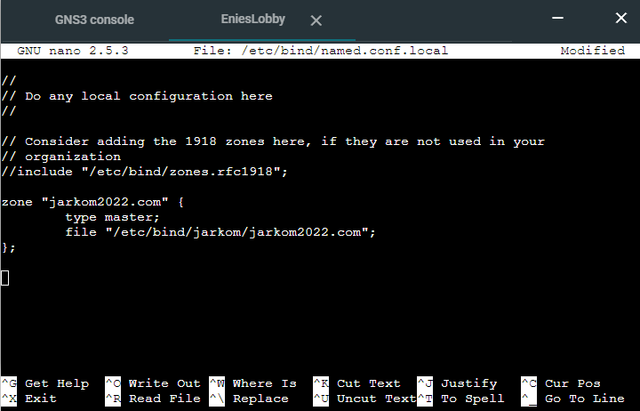

- Make folder **jarkom** inside **/etc/bind**

  ```
  mkdir /etc/bind/jarkom
  ```

- Copy the **db.local** file in the path **/etc/bind** into the **jarkom** folder you just created and rename it to **jarkom2022.com**

  ```
  cp /etc/bind/db.local /etc/bind/jarkom/jarkom2022.com
  ```

- Then open the **jarkom2022.com** file and edit it like the following picture with the IP *EniesLobby* for each group:

  ```
  nano /etc/bind/jarkom/jarkom2022.com
  ```

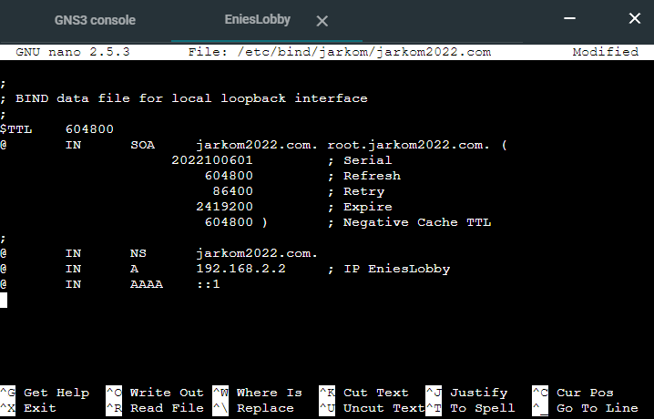

- Restart bind9 with command

  ```
  service bind9 restart
  
  OR
  
  named -g //Can be used for restarting as well as debugging
  ```


### 1.2.C Setting nameserver in client

The domain that we create will not be immediately recognized by the client, so we have to change the nameserver settings on our client.

- On the client *Loguetown* and *Alabasta* point the nameserver to IP *EniesLobby* by editing the _resolv.conf_ file by typing the command

	```
	nano /etc/resolv.conf
	```


- To try a DNS connection, ping the domain **jarkom2022.com** by doing the following command on the client *Loguetown* and *Alabasta*

  ```
  ping jarkom2022.com -c 5
  ```

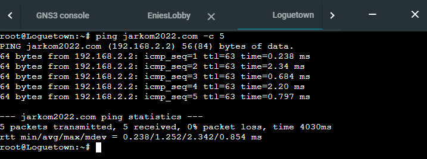


### 1.2.D Reverse DNS (Record PTR)

If in the previous domain creation our DNS server worked to translate the domain string **jarkom2022.com** into an IP address so that it could be opened, then Reverse DNS or PTR Records are used to translate IP addresses to previously translated domain addresses.

- Edit the file **/etc/bind/named.conf.local** in *EniesLobby*

  ```
  nano /etc/bind/named.conf.local
  ```

- Then add the following configuration into the **named.conf.local** file. Add a reverse of the first 3 bytes of the IP that you want to do Reverse DNS. Because in the example I used IP `192.168.2` for the IP of the records, then the reverse is `2.168.192`

  ```
  zone "2.168.192.in-addr.arpa" {
      type master;
      file "/etc/bind/jarkom/2.168.192.in-addr.arpa";
  };
  ```

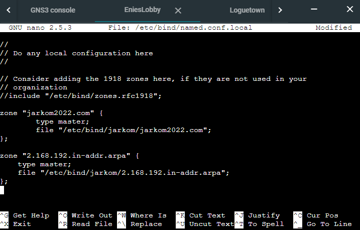

- Copy the **db.local** file in the path **/etc/bind** into the **jarkom** folder you just created and rename it to **2.168.192.in-addr.arpa**

  ```
  cp /etc/bind/db.local /etc/bind/jarkom/2.168.192.in-addr.arpa
  ```

  *Note: 2.168.192 is the first 3 bytes of IP EniesLobby which is reversed in the writing order*

- Edit the **2.168.192.in-addr.arpa** file to be like the image below


- Then restart bind9 with command

  ```
  service bind9 restart
  ```

- To check whether the configuration is correct or not, perform the following command on the client *Loguetown*

  ```
  // Install package dnsutils
  // Make sure the nameservers in /etc/resolv.conf have returned the same as the nameservers from Foosha
  apt-get update
  apt-get install dnsutils
  
  //Restore nameservers to connect with EniesLobby
  host -t PTR "IP EniesLobby"
  ```


### 1.2.E Record CNAME
A CNAME record is a record that creates an alias name and points the domain to another address/domain.

Steps to create a CNAME record:

- Open the **jarkom2022.com** file on the *EniesLobby* server and add the configuration as shown in the following image:


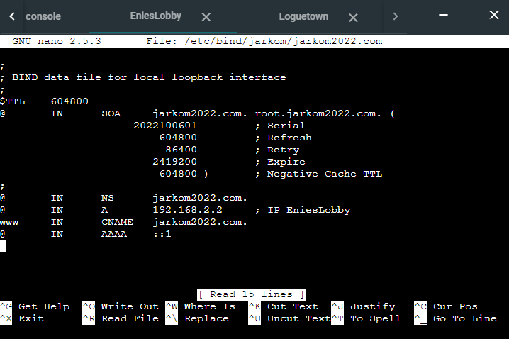


- Then restart bind9 with command

  ```
  service bind9 restart
  ```

- Then check by doing `host -t CNAME www.jarkom2022.com` or `ping www.jarkom2022.com -c 5`. The result should point to the host with the IP *EniesLobby*.


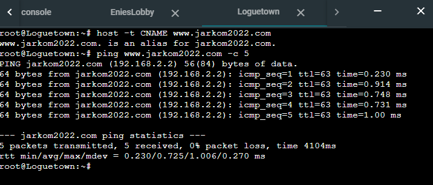


### 1.2.F Making DNS Slave

DNS Slave adalah DNS cadangan yang akan diakses jika server DNS utama mengalami kegagalan. Kita akan menjadikan server *Water7* sebagai DNS slave dan server *EniesLobby* sebagai DNS masternya.

#### I. Konfigurasi Pada Server EniesLobby

- Edit the file **/etc/bind/named.conf.local** and adjust it with the following syntax

  ```
  zone "jarkom2022.com" {
      type master;
      notify yes;
      also-notify { "IP Water7"; }; // Enter IP Water7 without quotes
      allow-transfer { "IP Water7"; }; // Enter IP Water7 without quotes
      file "/etc/bind/jarkom/jarkom2022.com";
  };
  ```

  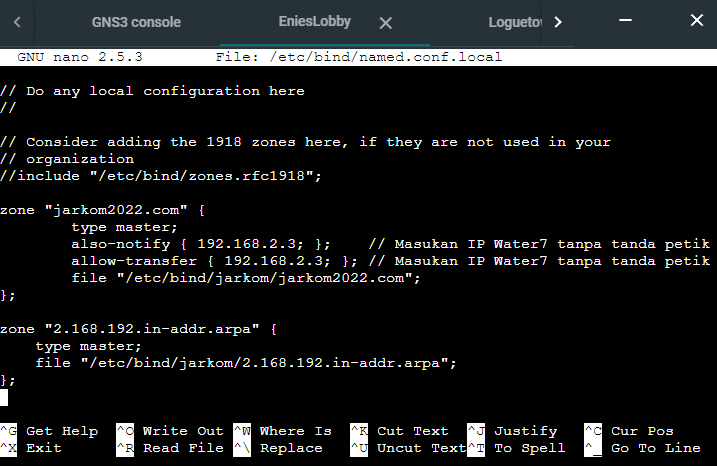


- Restart bind9

  ```
  service bind9 restart
  ```


#### II. Configuration on Water7 Server

- Open *Water7* and update package lists by running the command:

  ```
  apt-get update
  ```

- After updating, please install the bind9 application in *Water7* with the command:

  ```
  apt-get install bind9 -y
  ```

- Then open the **/etc/bind/named.conf.local** file in Water7 and add the following syntax:

  ```
  zone "jarkom2022.com" {
      type slave;
      masters { "IP EniesLobby"; }; // Enter IP EniesLobby without quotes
      file "/var/lib/bind/jarkom2022.com";
  };
  ```

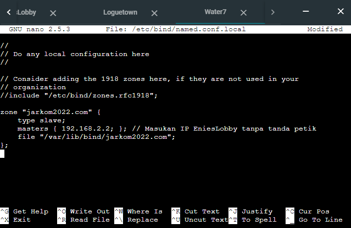

- Restart bind9

  ```
  service bind9 restart
  ```


#### III. Testing

- On the *EniesLobby* server, please turn off the bind9 service

  ```
  service bind9 stop
  ```

- On the *Loguetown* client, make sure the nameserver settings point to IP *EniesLobby* and IP *Water7*

  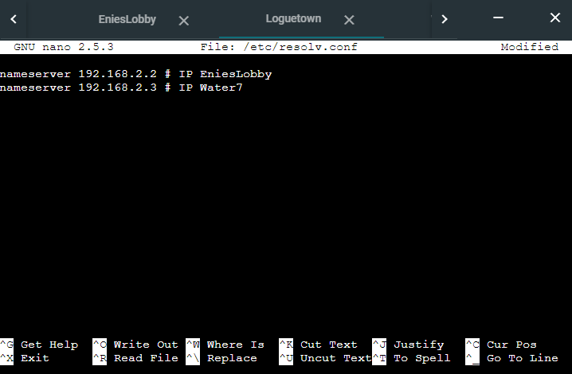

- Ping jarkom2022.com on the *Loguetown* client. If the ping is successful then the slave DNS configuration has been successful


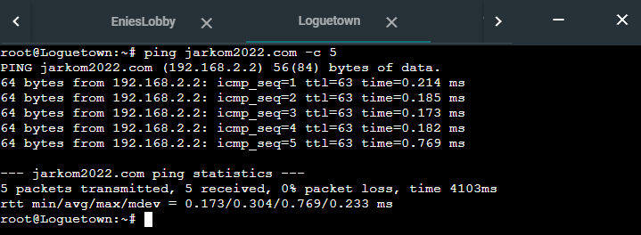


### 1.2.G Making Subdomain

A subdomain is part of a parent domain name. A subdomain generally refers to a physical address on a site for example: **jarkom2022.com** is a parent domain. Meanwhile **luffy.jarkom2022.com** is a subdomain.

- In *EniesLobby*, edit the file **/etc/bind/jarkom/jarkom2022.com** then add a subdomain for **jarkom2022.com** which points to the IP *Water7*.

  ```
  nano /etc/bind/jarkom/jarkom2022.com
  ```

- Add the configuration as in the picture into the **jarkom2022.com** file.

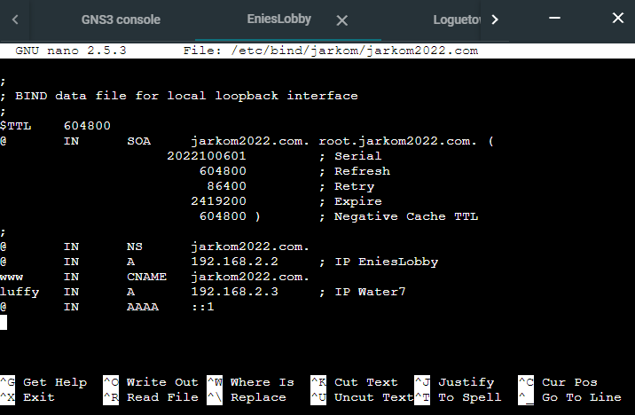

- Restart service bind  

  ```
  service bind9 restart
  ```

- Try pinging the subdomain with the following command from the client *Loguetown*

  ```
  ping luffy.jarkom2022.com -c 5
  
  OR
  
  host -t A luffy.jarkom2022.com
  ```

  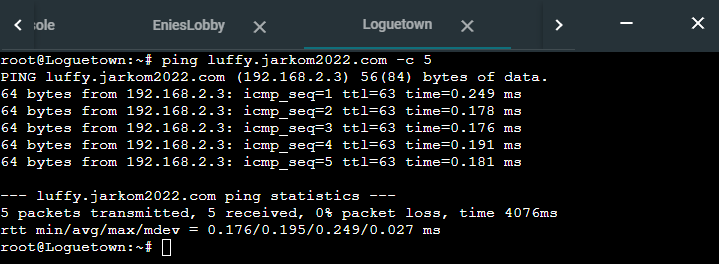


### 1.2.H Subdomain Delegation

Subdomain delegation is the delegation of authority over a subdomain to a new DNS.

#### I. *EniesLobby* Server Configuration

- In *EniesLobby*, edit the file **/etc/bind/jarkom/jarkom2022.com** and change it to be as below according to the IP *EniesLobby* division/distribution of each group.

  ```
  nano /etc/bind/jarkom/jarkom2022.com
  ```


- Then edit the file **/etc/bind/named.conf.options** in *EniesLobby*.

  ```
  nano /etc/bind/named.conf.options
  ```

- Then comment **dnssec-validation auto;** and add the following line to **/etc/bind/named.conf.options**

  ```
  allow-query{any;};
  ```


- Then edit the **/etc/bind/named.conf.local** file to be like the image below:

  ```
  zone "jarkom2022.com" {
      type master;
      file "/etc/bind/jarkom/jarkom2022.com";
      allow-transfer { "IP Water7"; }; // Enter IP Water7 without quotes
  };
  ```


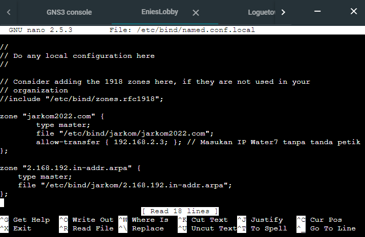

- Then, restart bind9

  ```
  service bind9 restart
  ```

#### II. *Water7* Server Configuration

- In *Water7* edit the file **/etc/bind/named.conf.options**

  ```
  nano /etc/bind/named.conf.options
  ```

- Then comment **dnssec-validation auto;** and add the following line to **/etc/bind/named.conf.options**

  ```
  allow-query{any;};
  ```


- Then edit the **/etc/bind/named.conf.local** file to be like the image below:

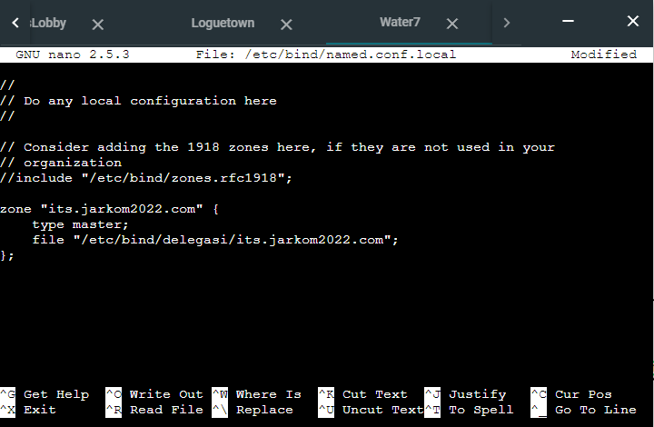

- Then create a directory with the name **delegasi**

- Copy **db.local** to the pucang directory and edit the name to **its.jarkom2022.com** 

  ```
  mkdir /etc/bind/delegasi
  cp /etc/bind/db.local /etc/bind/delegasi/its.jarkom2022.com
  ```

- Then edit the **its.jarkom2022.com** file to be like this


- Restart bind9

  ```
  service bind9 restart
  ```

#### III. Testing

- Ping the domains **its.jarkom2022.com** and **integra.its.jarkom2022.com** from the *Loguetown* client


### 1.2.I DNS Forwarder

DNS Forwarder is used to direct the DNS Server to the IP you want to go to.

- Edit the file **/etc/bind/named.conf.options** on the *EniesLobby* server
- Uncomment in this section

```
forwarders {
    "IP nameserver dari Foosha";
};
```
- Comment on this section

```
// dnssec-validation auto;
```
- And add

```
allow-query{any;};
```

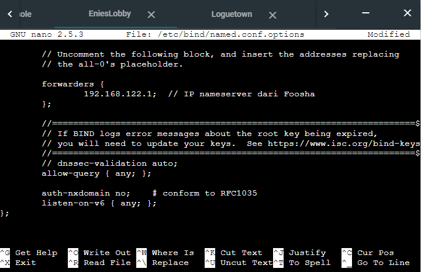
- Restart bind9

  ```
  service bind9 restart
  ```

- It should be that if the nameserver in the **/etc/resolv.conf** file on the client is changed to IP EniesLobby it will be forwarded to GNS3's DNS IP which is IP nameservers in Foosha and can get a connection.
- Try pinging google.com on Loguetown, if it's true then you can still get a response from google


### 1.3 Description of Zone file configuration

1. #### Serial Writing

   Written in YYYYMMDDXX format. The serial is incremented every time you make changes to the zone file.

   ```
   YYYY is Year
   MM is Month
   DD is Day
   XX is Counter
   ```

   Example:

   

2. #### Usage of Dot

   

   In one of the examples above, we can observe that in the fourth column there are records that use a dot at the end of the word and some do not. The use of dots serves as a determinant of the FQDN (Fully-Qualified Domain Name) of a domain.

   For example, if "**jarkom2022.com.**" ends with a period/dot it will be treated as an FQDN and will be read as "**jarkom2022.com**" , while ns1 above does not use a period/dot so it is not read as an FQDN. Then ns1 will be added in front of the $ORIGIN value so that ns1 will read as "**ns1.jarkom2022.com**" . The $ORIGIN value is taken from the zone name found in */etc/bind/named.conf.local*.

3. #### Writing Name Server (NS) records

   One of the rules for writing an NS record is that it must go to the A record., not the CNAME.


## Excercise

1. Make it so that when we check *IP EniesLobby* using dnsutils (host -t PTR 'IP EniesLobby') the result is that the IP belongs to the domain **jarkom.com** !
2. Create subdomains **seru.jarkom.com**, **pre-test.jarkom.com**, and **cool.jarkom.com** that point to *IP Water7*!
3. Create a subdomain **kerja.jarkom.com**. Then create a subdomain within a subdomain in the **yyy.lagi.ngerjain.jarkom.com** subdomain that points to EniesLobby ! (yyy = group name)
4. Create CNAME records **bagus.jarkom.com** and **semangat.yyy.jarkom.com** that point to **jarkom.com**! (yyy = group name)
5. Delegate **yyy.ngerjain.jarkom.com** and **fun.yyy.ngerjain.jarkom.com** subdomains from EniesLobby to Water7 ! (yyy = group name)

## References
* https://computer.howstuffworks.com/dns.htm
* http://knowledgelayer.softlayer.com/faq/what-does-serial-refresh-retry-expire-minimum-and-ttl-mean
* https://en.wikipedia.org/wiki/List_of_DNS_record_types
* https://kb.indowebsite.id/knowledge-base/pengertian-catatan-dns-atau-record-dns/
